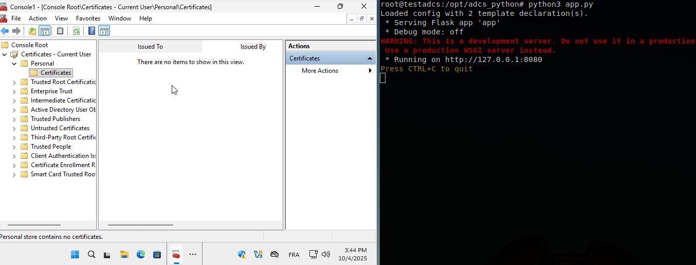
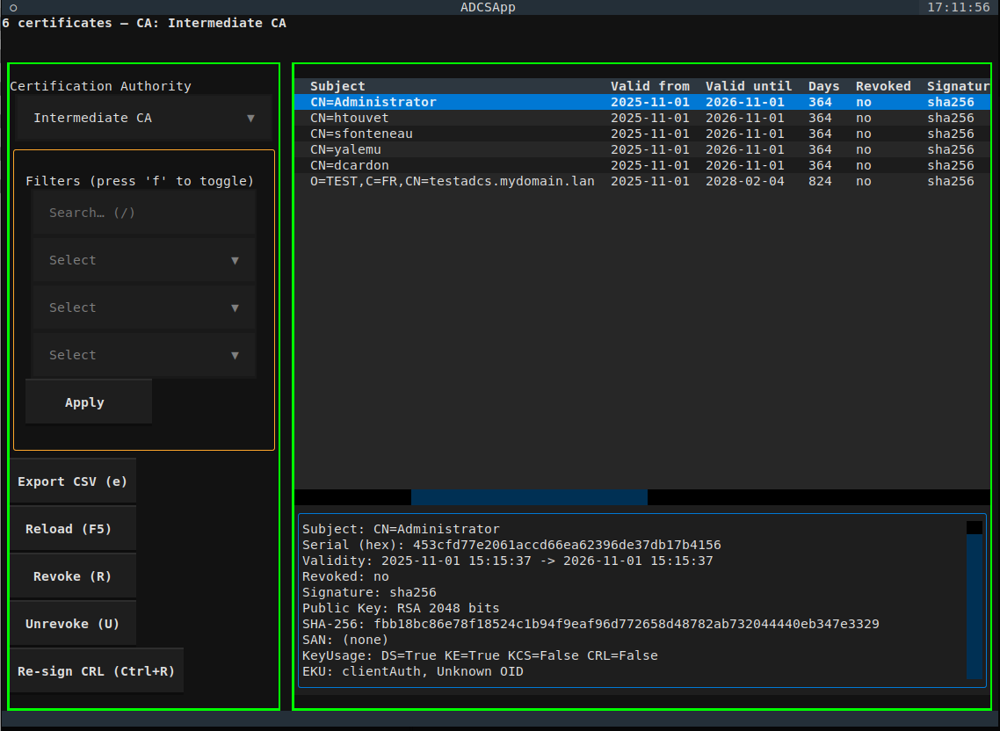

Purpose
==========================================================

This project emulates an ADCS enrollment server (not a client). It mimics the behavior of Microsoft ADCS Web Enrollment endpoints (CEP/CES) to handle certificate requests.

- **Certificate Enrollment Policy (CEP)** — exposes a policy endpoint 
  to provide enrollment templates and CA information to clients.
- **Certificate Enrollment Services (CES)** — emulates the service that 
  accepts CSRs and returns signed certificates.

The goal is to emulate an ADCS web enrollment server that:

- Serves CEP policy (templates, CAs, etc.) to requesting clients.
- Receives and validates PKCS#10 CSRs.
- Processes submissions via CES and returns signed responses.


  
🚨 Limitations/Status
----------------------------------------------------------

- Minimal testing
- Not audited for security
- Only tested in isolated **lab environments**
- No guarantees of correctness or compatibility
- Much of the code was created using AI.


## 🔧 Certificate Templates via Callback

In this project, certificate **templates** (CEP/CES) are not hardcoded in the server.  
Instead, they are defined through **Python callbacks**.  

Each template is represented by an external module (e.g. `callbacks/user_template.py`) exposing two required functions:

- **`define_template(app_conf, kerberos_user)`**  
  → Dynamically describes the template properties (OID, EKU, KeyUsage, validity period, etc.) depending on the user or context.

- **`emit_certificate(...)`**  
  → Takes the CSR and metadata as input, applies the necessary extensions, and issues the certificate signed by the CA.

### Why callbacks?
- Provides **maximum flexibility**: template logic can depend on Active Directory attributes, group membership, external policies, or any business rule.  
- Avoids locking the CA server into static, predefined templates.

### ⚠️ Security responsibility
This design shifts most of the **security checks** to the callback author.  
In practice:
- **Eligibility checks** (who is allowed to get what kind of certificate) must be implemented **inside the callback** (e.g. enforce AD group membership, adjust validity periods, or restrict EKUs).  
- If the callback does not enforce checks, **any authenticated user could obtain any certificate** that the module returns.  
- The Python ADCS server does not impose extra restrictions: it simply executes the callback and signs the result.

👉 **In short: the security and enforcement of issuance rules are entirely the responsibility of the callback code.**


ADCS Python Installation
==========================================

Requirements
-------------------

- Linux server (Debian/Ubuntu) (not ad server)
- Root access
- A functional Active Directory domain

Install dependencies
---------------------------------------------------------

```
apt-get update
apt-get install -y \
       samba \
       msktutil \
       nginx \
       python3-textual \
       python3-flask \
       python3-asn1crypto \
       python3-kerberos \
       krb5-user \
       git \
       python3-defusedxml \
       python3-pyasn1 \
       python3-jwcrypto \
       python3-waitress
```

Retrieve the project
---------------------------------------------------------

```
cd /opt
git clone https://github.com/tranquilit/adcs_python.git
cd adcs_python
```   

Create a local CA (for testing)
---------------------------------------------------------
 
```
mkdir /var/lib/adcs/
cd /opt/adcs_python
bash create_ca.sh
mv /opt/adcs_python/pki /var/lib/adcs/pki
```

Initial configuration
---------------------------------------------------------

- Copy the configuration template:

```
mkdir /etc/adcs
cp -f /opt/adcs_python/adcs.yaml.template /etc/adcs/adcs.yaml
```

- Edit ``adcs.yaml`` if needed.

- Create the request directory:

Copy template exemple, and edit if needed:

```
cp -r /opt/adcs_python/callbacks /etc/adcs/callbacks
```

Create list_request_id folder:

```
mkdir /var/lib/adcs/list_request_id
```

Configure Nginx
---------------------------------------------------------

- Replace the default configuration:

```
cp -f /opt/adcs_python/nginx-conf.conf.template /etc/nginx/sites-enabled/default
```

- Generate Diffie-Hellman parameters:

```
openssl dhparam -out /etc/ssl/certs/dhparam.pem 4096
```

Join the Active Directory domain
---------------------------------------------------------


- Edit ``/etc/krb5.conf`` for your domain.

```
[libdefaults]
dns_lookup_realm = false
dns_lookup_kdc = true
default_realm = MYDOMAIN.LAN
```

- Edit ``/etc/samba/smb.conf`` for your domain.

```
[global]
  workgroup = MYDOMAIN
  security = ADS
  realm = MYDOMAIN.LAN
  winbind separator = +
  idmap config *:backend = tdb
  idmap config *:range = 700001-800000
  idmap config MYDOMAIN:backend  = rid
  idmap config MYDOMAIN:range  = 10000-700000
  winbind use default domain = yes
  kerberos method = secrets and keytab
```

Join : 
```
kinit <user>@MYDOMAIN.LAN
net ads join
```

Manage SPN and Keytab
---------------------------------------------------------

- In Active Directory, register the HTTP SPN for the machine account:

```
HTTP/testadcs.mydomain.lan
```

- Generate the keytab:

```
net ads keytab create
```

Checking if http is present in the keytab :

```
klist -k -K /etc/krb5.keytab |grep HTTP
```

- Add the machine FQDN and IP address to ``/etc/hosts``   **important**.

Start the ADCS Python server
---------------------------------------------------------

```
cd /opt/adcs_python && python3 app.py
```

- (Optional) Create a **systemd** service to start ADCS automatically.

Test on a Windows client
---------------------------------------------------------

- Install the root CA generated: ``/var/lib/adcs/pki/certs/ca.crt.pem``  
- Install the intermediate CA generated: ``/var/lib/adcs/pki/certs/ica.crt.pem``  

- In the Windows **MMC Certificates** console → **Personal** → **Certificates** → *Request a certificate*  
  → Provide the service URL, for example:

```
https://testadcs.mydomain.lan/CEP
```

  *(The URL can be configured via GPO.)*

🔁 CRL Re-signing & Certificate Re-issuance
==========================================

Regenerate and re-sign the CRL for the specified CA:
-----------------------------------------------------------------

```bash
cd /opt/adcs_python
./manageca.py --resign-crl --ca-id ca-1
```

- `--ca-id` is the CA identifier (e.g., `ca-1`).
- This updates the CRL (version number, `thisUpdate/nextUpdate`, signature).

Rotate adcs Certificate When Expiring Soon 
-----------------------------------------------------------------

```bash
cd /opt/adcs_python
./manageca.py --rotate-if-expiring --ca-id ca1-inter --crt-path /var/lib/adcs/pki/certs/ica/testadcs.mydomain.lan.fullchain.pem  --key-path /var/lib/adcs/pki/private/ica/testadcs.mydomain.lan.key.pem --threshold-days 30 --chain /var/lib/adcs/pki/certs/ica/ica-chain.pem --valid-days 365
```

- `--ca-id` is the CA identifier (e.g., `ca-1`).

Re-sign / Re-issue a Certificate (GUI)
-----------------------------------------------------------------

Launch the admin GUI, then select the target certificate to re-sign/re-issue:

```bash
cd /opt/adcs_python
./manageca.py
```  



Desired enhancements for the project.
==========================================

- certsrv emulation : Emulate Microsoft ADCS `certsrv` web enrollment.


Frequently Asked Questions (FAQ)
==========================================

Is it possible to issue certificates to machines or users from multiple Active Directory domains?
-------------------------------------------------------------------------------------------------------------------------------------

Yes.  
You can follow the same approach described in the WAPT documentation:  
👉 [https://www.wapt.fr/en/doc-2.6/wapt-security-configuration-server.html#you-have-multiple-active-directory-domains-with-or-without-relationships](https://www.wapt.fr/en/doc-2.6/wapt-security-configuration-server.html#you-have-multiple-active-directory-domains-with-or-without-relationships)

You will simply need to:

- Modify the **`/etc/krb5.keytab`** file to include entries for each domain.  
- Create a **machine account** in each domain so that the server can authenticate and obtain Kerberos tickets.

This allows the ADCS Python server to handle certificate requests from **multiple domains**, whether or not they have **trust relationships**.

Is it possible to build a certificate request validation system linked to an HR database (not connected to Active Directory)?
-------------------------------------------------------------------------------------------------------------------------------------

Yes, absolutely.  
Within the **callback**, you can decide whether a given **request ID** should be validated or rejected before issuing the certificate.

For example:

- Query an **external HR database** to determine if the requester is eligible.  
- Refuse to issue a certificate if the employee’s **contract end date** has passed.  
- Adjust the **certificate validity period** based on HR information.

👉 **In short:** any validation, verification, or business rule can be implemented directly inside the callback **before the certificate is issued**.

I am a certificate provider and I would like to offer this service, but authentication is based on username/password. Is it possible?
-------------------------------------------------------------------------------------------------------------------------------------

Yes.  

A **callback for HTTP Basic authentication** (`username/password`) is already available:  
👉 `callbacks/auth_basic_template.py`

In this callback, you receive both the **username** and **password** entered by the user.  
It is up to you to implement and validate the authentication logic (for example, by checking against an external database or API).

⚠️ **Important:**  
Make sure your authentication process responds **within the allowed time frame** - otherwise, the request will **timeout** and fail.


Can this project be used as a gateway/proxy to another PKI without holding a private key?
-----------------------------------------------------------------------------------------------------

Yes.

You can run this ADCS Python server as a pass-through gateway, where it does not hold the CA private key itself. Instead, it simply forwards the CSR to another PKI system and then wraps the returned certificate in a response that looks like Microsoft ADCS.

In practice, the ADCS web enrollment client expects a PKCS#7/CMS response containing the issued certificate (and optionally the chain).
From my tests, the PKCS#7 structure can be “degenerate” (i.e. contain the certificate but no signature / no signers) and it will still be accepted by the Windows client.

However, a real Microsoft ADCS instance signs the PKCS#7 it returns, so this behavior is somewhat fragile and could change between versions or environments.

To do things cleanly and stay as close as possible to actual ADCS behavior, you should also ensure that:

The certificate template OID corresponding to the requested template is correctly added as an extension on the issued certificate.

In short: yes, you can use this project as a stateless gateway in front of another PKI, but be aware that relying on unsigned (“degenerate”) PKCS#7 responses is a bit touchy and should be tested carefully in your environment.
