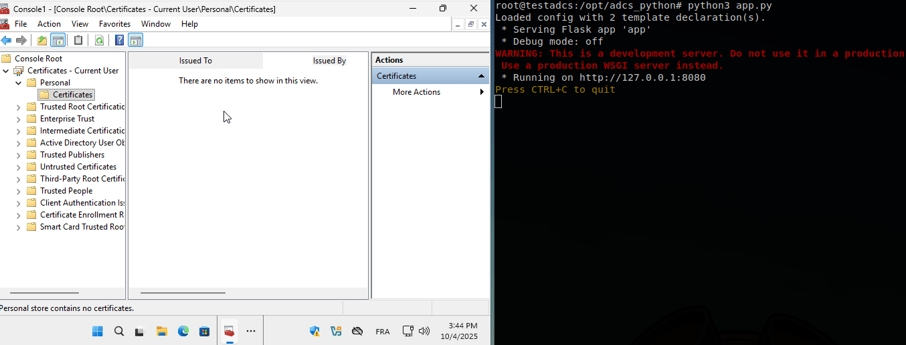
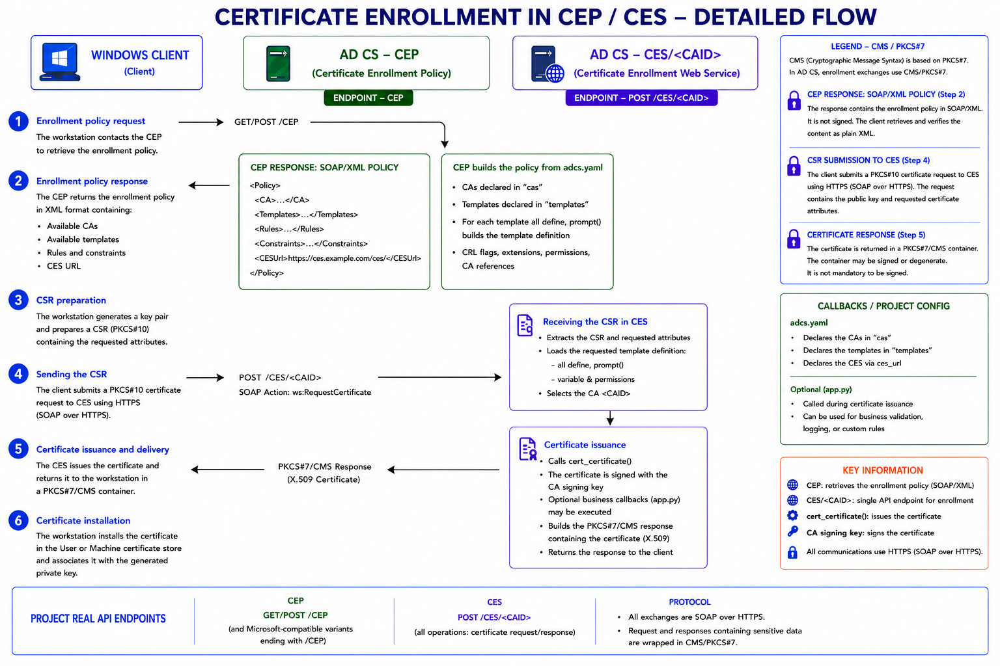
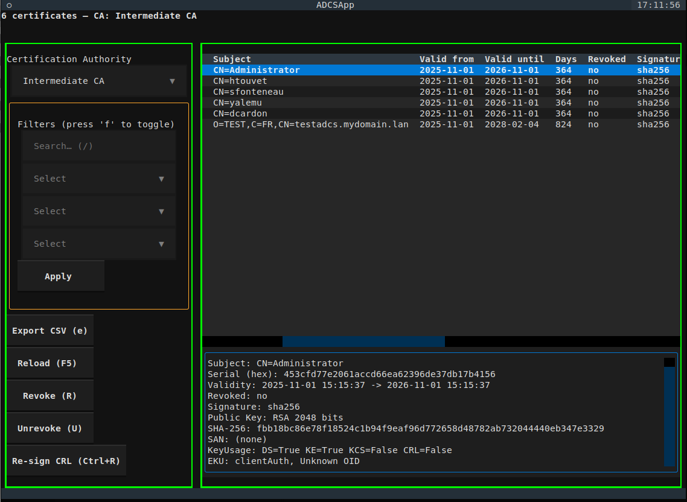
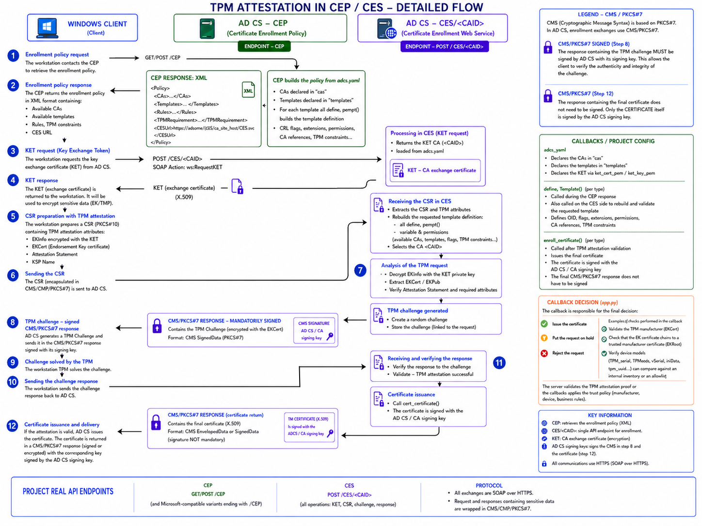

Purpose
==========================================================

This project emulates an ADCS enrollment server (not a client). It mimics the behavior of Microsoft ADCS Web Enrollment endpoints (CEP/CES) to handle certificate requests.

- **Certificate Enrollment Policy (CEP)** — exposes a policy endpoint 
  to provide enrollment templates and CA information to clients.
- **Certificate Enrollment Services (CES)** — emulates the service that 
  accepts CSRs and returns signed certificates.

The goal is to emulate an ADCS web enrollment server that:

- Serves CEP policy (templates, CAs, etc.) to requesting clients.
- Receives and validates PKCS#10 CSRs.
- Processes submissions via CES and returns signed responses.


  
🚨 Limitations/Status
----------------------------------------------------------

- Not audited for security
- No guarantees of correctness or compatibility
- A large portion of the code was generated with the help of AI.


## 🔧 Certificate Templates via Callback

In this project, certificate **templates** (CEP/CES) are not hardcoded in the server.  
Instead, they are defined through **Python callbacks**.  

Each template is represented by an external module (e.g. `callbacks/user_template.py`) exposing two required functions:

- **`define_template(app_conf, username)`**  
  → Dynamically describes the template properties (OID, EKU, KeyUsage, validity period, etc.) depending on the user or context.

- **`emit_certificate(...)`**  
  → Takes the CSR and metadata as input, applies the necessary extensions, and issues the certificate signed by the CA.

### Why callbacks?
- Provides **maximum flexibility**: template logic can depend on Active Directory attributes, group membership, external policies, or any business rule.  
- Avoids locking the CA server into static, predefined templates.

### ⚠️ Security responsibility
This design shifts most of the **security checks** to the callback author.  
In practice:
- **Eligibility checks** (who is allowed to get what kind of certificate) must be implemented **inside the callback** (e.g. enforce AD group membership, adjust validity periods, or restrict EKUs).  
- If the callback does not enforce checks, **any authenticated user could obtain any certificate** that the module returns.  
- The Python ADCS server does not impose extra restrictions: it simply executes the callback and signs the result.
- The callback receives CMS/CMC signature metadata in the `info` object (`cmc_signature_valid`, `cmc_signatures`, and related errors). Verifying this is not always required, but it is necessary when the callback relies on a signed request for RA-style validation or other signature-based authorization.

👉 **In short: the security and enforcement of issuance rules are entirely the responsibility of the callback code.**




ADCS Python Installation
==========================================

Requirements
-------------------

- Linux server (Debian/Ubuntu) (not ad server)
- Root access
- A functional Active Directory domain

Install dependencies
---------------------------------------------------------

```
apt-get update
apt-get install -y \
       samba \
       samba-dsdb-modules \
       msktutil \
       nginx \
       python3-textual \
       python3-flask \
       python3-asn1crypto \
       python3-gssapi \
       krb5-user \
       git \
       python3-defusedxml \
       python3-pyasn1 \
       python3-waitress \
       python3-yaml \
       python3-samba \
       python3-cryptography \
       python3-pkcs11 \
       python3-itsdangerous
```

Retrieve the project
---------------------------------------------------------

```
cd /opt
git clone https://github.com/tranquilit/adcs_python.git
cd adcs_python
```   


Initial configuration
---------------------------------------------------------

- Copy the configuration template:

```
mkdir /etc/adcs
cp -f /opt/adcs_python/adcs.yaml.template /etc/adcs/adcs.yaml
```

- Edit ``adcs.yaml`` if needed.

Copy template exemple, and edit if needed:

```
cp -r /opt/adcs_python/callbacks /etc/adcs/callbacks
```


ADCS CLI, SQLite cache and optional Textual interface
====================================================

There are **two** independent entry points:

* `./adcs-tool`: non-interactive command-line administration.
* `./manage-ca-ui`: Gui interface .


```bash
./adcs-tool ca list
./adcs-tool ca list --json
./adcs-tool ca show ca_inter_test
./adcs-tool ca show ca_inter_test --json
./adcs-tool callback list
./adcs-tool callback list --json
./adcs-tool config show --json  # secrets are redacted
```

List certificates from any CA, applying the same 30-day expiration and
revocation filters as the UI:

```bash
./adcs-tool certificate list --ca ca_inter_test
./adcs-tool certificate list --ca ca_inter_test --search example.org --status expiring
./adcs-tool certificate list --ca ca_inter_test --filter --status expired --revocation revoked
./adcs-tool certificate list --ca ca_inter_test --revocation revoked --limit 0
./adcs-tool certificate list --ca ca_inter_test --order-by "expiration_date ASC, serial DESC" --limit 200
./adcs-tool certificate list --ca ca_inter_test --order-by "revoked DESC, not_after ASC" --json
./adcs-tool certificate list --help  # complete list of permitted ORDER BY fields
# --filter is optional for certificate list; status/revocation/search work without it.
```

Valid statuses are `any`, `expired`, `expiring` (within the next 30 days),
`valid` (more than 30 days). Revocation values are `any`, `revoked` and
`not_revoked`. `--limit` defaults to **1000** (overridden by positive
`ADCS_MAX_ROWS`); **0** means unlimited. Sort expressions accept whitelisted
field names only, and each field may specify `ASC` or `DESC`, separated by
commas. The help always lists available fields. `--json` is available for
scripting.

View and manage a particular certificate, using its **hexadecimal serial**:

```bash
./adcs-tool certificate show --ca ca_inter_test --serial 0x1234 --json
./adcs-tool certificate revoke --ca ca_inter_test --serial 0x1234
./adcs-tool certificate revoke --ca ca_inter_test --serial 0x1234 --dry-run
./adcs-tool certificate unrevoke --ca ca_inter_test --serial 0x1234
./adcs-tool certificate unrevoke --ca ca_inter_test --serial 0x1234 --dry-run
./adcs-tool certificate delete --ca ca_inter_test --serial 0x1234
./adcs-tool certificate delete --ca ca_inter_test --serial 0x1234 --dry-run
./adcs-tool crl resign --ca ca_inter_test
./adcs-tool crl resign-all
```

Filtered bulk revocation and unrevocation use the same SQLite-backed filtering,
search, ordering, and limit options as `certificate list` and `certificate delete`.
Both display a **dry-run preview by default**; `--yes` is required to update
CRLs. Existing CA certificates and entries already in the requested revocation
state are skipped. `--serial` continues to perform an individual operation.
`--dry-run` and `--yes` cannot be combined.

```bash
# Preview revoking valid, currently unrevoked certificates matching "radius"
./adcs-tool certificate revoke --ca ca_inter_test --filter --status valid --revocation not_revoked --search radius --order-by "not_after ASC" --limit 100
# Execute after reviewing the preview
./adcs-tool certificate revoke --ca ca_inter_test --filter --status valid --revocation not_revoked --search radius --order-by "not_after ASC" --limit 100 --yes
# Preview removing revocation for revoked certificates matching "radius"
./adcs-tool certificate unrevoke --ca ca_inter_test --filter --revocation revoked --search radius --dry-run
# Execute
./adcs-tool certificate unrevoke --ca ca_inter_test --filter --revocation revoked --search radius --yes
```

Bulk certificate cleanup uses the same SQLite-backed filters as the listing
command. By default, bulk deletion is a **dry run**, showing a table of
certificates selected without moving files:

```bash
# Expired OR revoked certificates (including expired non-revoked)
./adcs-tool certificate delete --ca ca_inter_test --eligible
# Only certificates BOTH expired AND revoked
./adcs-tool certificate delete --ca ca_inter_test --filter --status expired --revocation revoked
# Optional search, sorting and limit
./adcs-tool certificate delete --ca ca_inter_test --filter --status expired --search example.org --order-by "not_after ASC" --limit 100
# Execute the operation after reviewing the preview
./adcs-tool certificate delete --ca ca_inter_test --eligible --dry-run
./adcs-tool certificate delete --ca ca_inter_test --eligible --yes
```

`--eligible` selects the union (expired **or** revoked); `--filter` combines
`--status`, `--revocation` and `--search` with AND. The bulk operation skips
CA certificates and skips certificates that are neither expired nor revoked,
even when the requested filters match them. `--limit 0` selects all matching
rows. `--yes` is required for bulk changes, and failed files are reported.
Single-certificate `--serial` deletion retains its existing behaviour.

**Safety:** `certificate delete` refuses to remove a currently valid,
non-revoked certificate. Deletion moves the certificate and corresponding
private key into `.trash` as in the GUI; revocation is determined from the
current CRL, not a stale SQLite flag.

New certificate issuance and the other previously available non-interactive
operations are available as `ca create`, `certificate issue`, `ket create`,
`csr submit` and `certificate rotate`. See each subcommand's `--help` for
parameters. The `ca create` **stdout YAML block is unchanged** and can still
be appended using `>> /etc/adcs/adcs.yaml` as shown below. Diagnostics are
written to stderr. For a custom configuration file, pass
`--confadcs /path/to/adcs.yaml` before the command or after the command family (for example, `adcs-tool --confadcs /etc/adcs/adcs.yaml ca list`).

Launch the Textual interface with:

```bash
./manage-ca-ui --confadcs /etc/adcs/adcs.yaml
```

Create a local CA (for testing)
---------------------------------------------------------
 
By default, `./adcs-tool ca create` generates an RSA CA:

```
./adcs-tool ca create --cn "CA Root Test" --aia-crl-base-url "http://testadcs.mydomain.lan" >> /etc/adcs/adcs.yaml
./adcs-tool ket create --ca-id "CA Root Test" >> /etc/adcs/adcs.yaml
./adcs-tool ca create --signer-ca-id "CA Root Test" --cn "CA Inter Test" --aia-crl-base-url "http://testadcs.mydomain.lan" >> /etc/adcs/adcs.yaml
./adcs-tool ket create --ca-id "CA Inter Test" >> /etc/adcs/adcs.yaml
./adcs-tool certificate issue --signer-ca-id "CA Inter Test" --cn testadcs.mydomain.lan --san testadcs.mydomain.lan --crt-path /etc/nginx/crt.pem --key-path /etc/nginx/key.pem
```

To generate an ECC CA instead, use `--key-type ec` and select the curve with `--ec-curve`:

```
./adcs-tool ca create --cn "CA Root ECC Test" --key-type ec --ec-curve secp384r1 --aia-crl-base-url "http://testadcs.mydomain.lan" >> /etc/adcs/adcs.yaml
```

Supported ECC curves are `secp256r1`, `secp384r1`, and `secp521r1`. Aliases such as `prime256v1`, `p-256`, `p-384`, and `p-521` are also accepted.


Create a CA certificate from an existing CSR public key
---------------------------------------------------------

`./adcs-tool ca create` can also create a CA certificate from an existing CSR with `--csr-path`.
This is useful when the future CA private key is generated and kept outside this tool, for example in an HSM.

Only the public key is read from the CSR. The CSR subject, SANs, attributes, and requested extensions are ignored.
The CA certificate subject is still built from the `--cn` value and the CA extensions are still generated by `adcs-tool`.

Example:

```
# Generate or export a CSR for the future CA key.
# The private key may be local, in an HSM, or managed by another component.
openssl req -new \
  -key subca.key \
  -out subca.csr.pem \
  -subj "/CN=Ignored CSR Subject"

# Issue the new CA certificate with the public key from the CSR.
# The certificate subject below is "CA Inter HSM Test", not the CSR subject.
./adcs-tool ca create \
  --signer-ca-id "CA Root Test" \
  --cn "CA Inter HSM Test" \
  --csr-path subca.csr.pem \
  --aia-crl-base-url "http://testadcs.mydomain.lan" >> /etc/adcs/adcs.yaml
```

When `--csr-path` is used, `--signer-ca-id` is required because the CA certificate is signed by an existing parent CA.
No private key is generated or written for the new CA, and no initial CRL is created for it because the new CA private key is not available to `adcs-tool`.


> A **KET certificate** (**Key Exchange Token**) is a special certificate used to protect the **exchange of encrypted enrollment data** between the client and the server in Microsoft ADCS workflows, for example for **TPM attestation**.


Configure Nginx
---------------------------------------------------------

- Replace the default configuration:

```
cp -f /opt/adcs_python/nginx-conf.conf.template /etc/nginx/sites-available/default
```

- Generate Diffie-Hellman parameters:

```
openssl dhparam -out /etc/ssl/certs/dhparam.pem 4096
```

Restart Nginx: 

```
systemctl restart nginx
```

Nginx is responsible for handling SSL/TLS authentication and securely exposing the ADCS Python service.

Using a different Nginx configuration, or modifying the provided one without fully understanding the security implications, may compromise the authentication flow and weaken the overall security of the service.

Join the Active Directory domain
---------------------------------------------------------


- Edit ``/etc/krb5.conf`` for your domain.

```
[libdefaults]
dns_lookup_realm = false
dns_lookup_kdc = true
default_realm = MYDOMAIN.LAN
allow_weak_crypto = false
permitted_enctypes = aes256-cts-hmac-sha1-96 aes128-cts-hmac-sha1-96
default_tkt_enctypes = aes256-cts-hmac-sha1-96 aes128-cts-hmac-sha1-96
default_tgs_enctypes = aes256-cts-hmac-sha1-96 aes128-cts-hmac-sha1-96
```

- Edit ``/etc/samba/smb.conf`` for your domain.

```
[global]
  workgroup = MYDOMAIN
  security = ADS
  realm = MYDOMAIN.LAN
  winbind separator = +
  idmap config *:backend = tdb
  idmap config *:range = 700001-800000
  idmap config MYDOMAIN:backend  = rid
  idmap config MYDOMAIN:range  = 10000-700000
  winbind use default domain = yes
  kerberos method = secrets and keytab
```

Join : 
```
kinit <user>@MYDOMAIN.LAN
net ads join --use-kerberos=required
```

Manage SPN 
---------------------------------------------------------

- Register the HTTP SPN for the machine account:

```
samba-tool spn add "HTTP/testadcs.mydomain.lan" "testadcs$" -H ldap://srvads.mydomain.lan:389 --use-kerberos=required
```

Note that the URL must be in **lowercase**.

- Generate the keytab:

```
net ads keytab create
```

Checking if http is present in the keytab :

```
klist -k -K /etc/krb5.keytab |grep HTTP
```

- Add the machine FQDN and IP address to ``/etc/hosts``   **important**.

Start the ADCS Python server
---------------------------------------------------------

```
cd /opt/adcs_python && python3 app.py
```

- (Optional) Create a **systemd** service to start ADCS automatically.

Test on a Windows client
---------------------------------------------------------

- Install the root CA generated: ``http://testadcs.mydomain.lan/certs/ca_root_test/ca_root_test.crt.pem``  
- Install the intermediate CA generated: ``http://testadcs.mydomain.lan/certs/ca_inter_test/ca_inter_test.crt.pem``  

- In the Windows **MMC Certificates** console → **Personal** → **Certificates** → *Request a certificate*  
  → Provide the service URL, for example:

```
https://testadcs.mydomain.lan/ADPolicyProvider_CEP_Kerberos/service.svc/CEP
```

  *(The URL can be configured via GPO.)*

🔁 CRL Re-signing & Certificate Re-issuance
==========================================

Regenerate and re-sign the CRL 
-----------------------------------------------------------------

```bash
cd /opt/adcs_python
./adcs-tool crl resign-all
```

Add cron 

```cp -f /opt/adcs_python/adcs_cron /etc/cron.d/adcs_cron```

Rotate adcs Certificate When Expiring Soon 
-----------------------------------------------------------------

```bash
cd /opt/adcs_python
./adcs-tool certificate rotate --signer-ca-id "CA Inter Test" --crt-path /etc/nginx/crt.pem  --key-path /etc/nginx/key.pem --threshold-days 30 --valid-days 365
```

- `--signer-ca-id` is the CA identifier (e.g., `"CA Inter Test"`).

Re-sign / Re-issue a Certificate (GUI)
-----------------------------------------------------------------

Launch the admin GUI, then select the target certificate to re-sign/re-issue:

```bash
cd /opt/adcs_python
./manage-ca-ui
```  



## Submit a CSR from the command line
-----------------------------------------------------------------

You can submit a CSR directly from the command line without using the API interface:

```bash
/opt/adcs_python/adcs-tool csr submit --signer-ca-id 'ca_inter_test' --username 'srvads$@MYDOMAIN.LAN' --template-name 'dc' --csr-path srvads.csr
```

🔐 TPM Attestation
============================

The server supports **TPM attestation** during certificate enrollment.

### Supported TPM attestation flow

This project intentionally supports only the EK-based Microsoft TPM attestation flow:

```text
szOID_ENROLL_EK_INFO
```

The AIK-only flow is not implemented:

```text
szOID_ENROLL_AIK_INFO
```

The reason is to keep a single attestation path. The `szOID_ENROLL_EK_INFO` flow is sufficient for the supported use cases: it allows the server to perform the TPM activation challenge and gives the callback access to EK-related material, such as EKPub and EKCert.

Therefore, TPM templates should set:

```python
"attest_required": True,
"ek_validate_key": True
```

`ek_validate_key=True` makes Windows use the EK-based attestation flow expected by this server. It does not force the final trust decision to rely only on an EKPub allowlist. The callback remains responsible for deciding whether to trust the request based on EKPub, EKCert, manufacturer certificates, inventory data, or any other business rule.

During a request, it:

-   Verifies that the **TPM attestation challenge is correctly
    resolved**
-   Verifies that **EKPub / EKCert** were used to produce the
    attestation response

👉 This ensures the attestation is **technically valid**, but does **not
imply trust** in the TPM.

The following data is then passed to the callback:

-   `ek_cert`
-   `ek_public_key_identity_sha256`

Callback decision
--------------------

The callback is responsible for the final decision:

-   ✅ Issue the certificate\
-   ⏳ Put the request on hold\
-   ❌ Reject the request

### Example checks

**Validate TPM manufacturer (EKCert)**

Microsoft provides a list of TPM manufacturer certificates:\
👉 https://go.microsoft.com/fwlink/?linkid=2097925

``` python
is_directly_issued_by_cert_in_folder(
    tpm_result['ek_cert'],
    "/etc/adcs/TrustedTpm"
)
```

**Validate known device (EKPub fingerprint)**

``` python
tpm_result['ek_public_key_identity_sha256']
```

This value can be matched against an internal inventory, or whitelist.

The server validates the TPM attestation proof, while the callback
enforces the **trust policy** (manufacturer, device, business rules).





Desired enhancements for the project.
==========================================

- certsrv emulation : Emulate Microsoft ADCS `certsrv` web enrollment.


Frequently Asked Questions (FAQ)
==========================================

Is it possible to issue certificates to machines or users from multiple Active Directory domains?
-------------------------------------------------------------------------------------------------------------------------------------

Yes.  
You can follow the same approach described in the WAPT documentation:  
👉 [https://www.wapt.fr/en/doc-2.6/wapt-security-configuration-server.html#you-have-multiple-active-directory-domains-with-or-without-relationships](https://www.wapt.fr/en/doc-2.6/wapt-security-configuration-server.html#you-have-multiple-active-directory-domains-with-or-without-relationships)

You will simply need to:

- Modify the **`/etc/krb5.keytab`** file to include entries for each domain.  
- Create a **machine account** in each domain so that the server can authenticate and obtain Kerberos tickets.

This allows the ADCS Python server to handle certificate requests from **multiple domains**, whether or not they have **trust relationships**.

Is it possible to build a certificate request validation system linked to an HR database (not connected to Active Directory)?
-------------------------------------------------------------------------------------------------------------------------------------

Yes, absolutely.  
Within the **callback**, you can decide whether a given **request ID** should be validated or rejected before issuing the certificate.

For example:

- Query an **external HR database** to determine if the requester is eligible.  
- Refuse to issue a certificate if the employee’s **contract end date** has passed.  
- Adjust the **certificate validity period** based on HR information.

👉 **In short:** any validation, verification, or business rule can be implemented directly inside the callback **before the certificate is issued**.

I am a certificate provider and I would like to offer this service, but authentication is based on username/password. Is it possible?
-------------------------------------------------------------------------------------------------------------------------------------

Yes.  

A **callback for HTTP Basic authentication** (`username/password`) is already available:  
👉 `callbacks/auth_basic_template.py`

In this callback, you receive both the **username** and **password** entered by the user.  
It is up to you to implement and validate the authentication logic (for example, by checking against an external database or API).

⚠️ **Important:**  
Make sure your authentication process responds **within the allowed time frame** - otherwise, the request will **timeout** and fail.


**Can this project be used as a gateway/proxy to another PKI without holding a private key?**  
-----------------------------------------------------------------------------------------------------

Yes.

This ADCS Python server can be used as a transparent (pass-through) gateway without hosting the private key of the Certification Authority. It simply forwards the CSR to a remote PKI and then wraps the issued certificate into a response compatible with what a Microsoft ADCS client expects.

In practice, Windows enrollment clients (web enrollment, CertEnroll, etc.) expect a PKCS#7/CMS response containing the issued certificate (and optionally the certificate chain).

According to CMS specifications (RFC 5652) and Microsoft ADCS behavior (MS-WCCE), this structure can be **“degenerate”** (i.e., without a signature, with `signerInfos` absent). In that case, it acts purely as a container for certificates. This format is accepted by Windows clients.

https://datatracker.ietf.org/doc/html/rfc8894#name-degenerate-certificates-onl

This limitation is important for **TPM attestation**: the degenerate mode only works for certificate containers. For TPM attestation, Windows expects the challenge response to be a signed CMS/CMC structure and rejects it if the challenge is not signed.

However, a real Microsoft ADCS instance can return a **signed full CMC response**, especially when the client sets the `CR_IN_FULLRESPONSE` flag.

In this specific case, this project will not be able to respond correctly if it does not have access to a private key capable of signing the CMC response. A degenerate PKCS#7 response will not satisfy this requirement.

To stay as close as possible to actual ADCS behavior, it is recommended to:

- Return a signed CMC response when possible  
- Include the full certificate chain in the response  
- Add the certificate template OID as an extension in the issued certificate  
- Ensure the client properly validates the certification chain and the CA identity  

**Summary:**  
Yes, this project can be used as a stateless gateway in front of another PKI, as long as the client does not explicitly require a signed CMC response (`CR_IN_FULLRESPONSE`).

`--dry-run` on `certificate revoke`, `certificate unrevoke`, and `certificate delete` previews the action without changing certificates, private keys or CRLs. For bulk deletion, a preview is already the default unless `--yes` is passed; `--dry-run` and `--yes` cannot be combined. Cache indexing may still be refreshed during inspection.

### Bash Tab completion

To enable interactive Tab completion in the current Bash session from the project directory:

```bash
source ./adcs-tool.bash-completion
```

To enable it for every Bash session, install the completion file (as root, on systems with `bash-completion`):

```bash
install -Dm644 adcs-tool.bash-completion /usr/share/bash-completion/completions/adcs-tool
```

If invoking the command as `./adcs-tool`, load the script with `source` in your shell profile if the automatic completion loader does not load it.

Tab completes command groups, subcommands, options, enumerated values (`--status`, `--revocation`, `--key-type`), sorting fields for `--order-by`, filesystem paths and `--ca` identifiers from `adcs.yaml`. The CA config path defaults to `/etc/adcs/adcs.yaml` and can be changed via `--confadcs`. Completion reads configuration only: it never performs certificate operations or changes SQLite. Bash completion requires Bash; other shells are not configured by this script.


### Accessible CLI output (screen readers)

Read-only commands (`ca list/show`, `callback list`, `config show`,
`certificate list/show`) and certificate revoke/unrevoke/delete previews support
`--format table|accessible|json`. `table` is the default and preserves the
column display; `accessible` renders one labelled field per line; `json`
provides machine-readable output. The existing `--json` flag remains available
for read-only commands and takes precedence over `--format`.

```bash
./adcs-tool certificate list --ca ca-auth --format accessible
./adcs-tool certificate show --ca ca-auth --serial 0x1234 --format accessible
./adcs-tool certificate revoke --ca ca-auth --filter --status expired --dry-run --format accessible
./adcs-tool ca list --format json
export ADCS_OUTPUT_FORMAT=accessible  # optional default for supported commands
```

The environment setting can be overridden by `--format`. An invalid environment
value falls back to `table`. The CA creation command deliberately retains its
original stdout format for existing redirections. Screen-reader behaviour
should be validated with the actual terminal and assistive technology.
